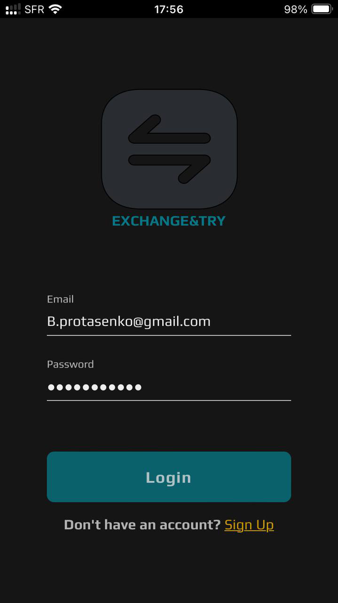
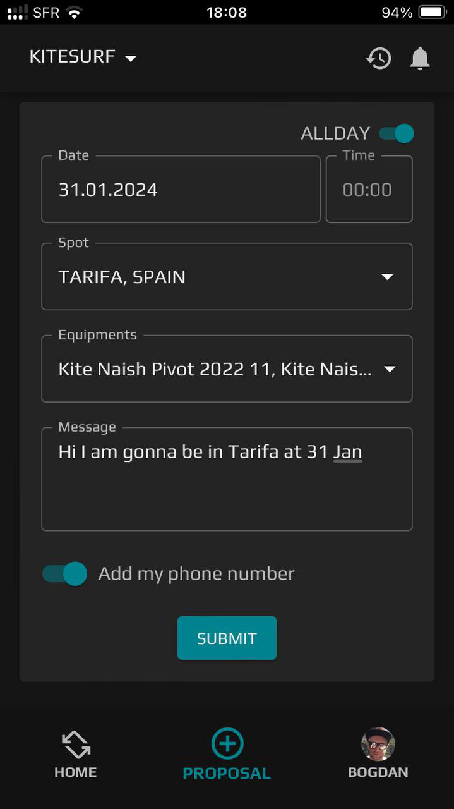
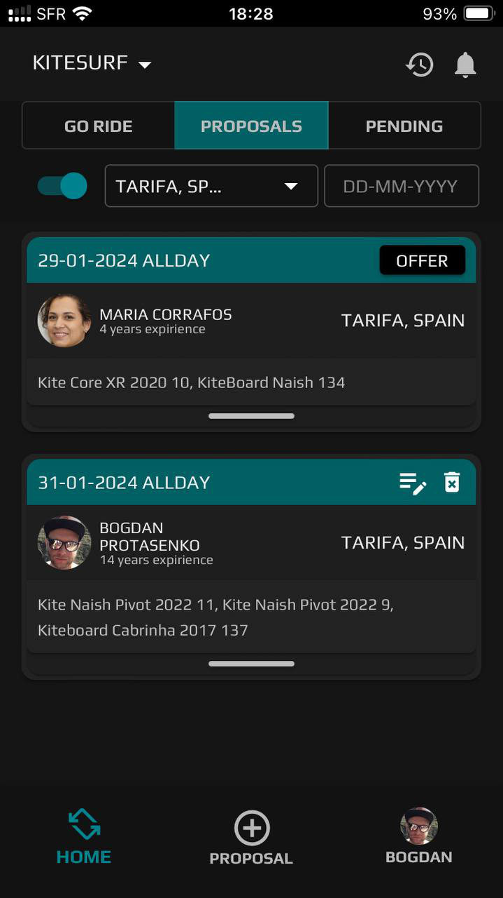
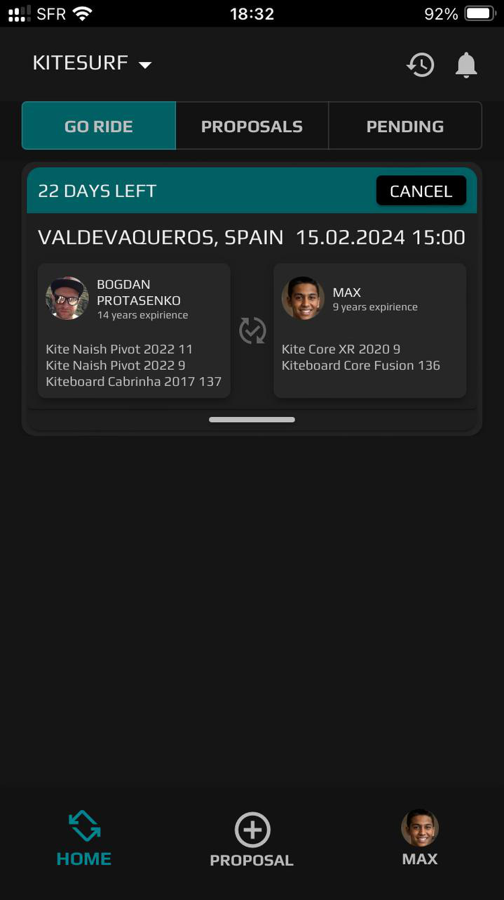

# EXCHANGE&TRY APP

The [EXCHANGE&TRY](https://spectacular-starlight-b3ee92.netlify.app) APP aims to
connect riders with each other, providing a platform to exchange equipment and
gain new experiences.

    
    
    
    
    
    

## Research

I am a rider who is totally into kitesurfing and snowboarding. These have been
my passions for about 15 years. Throughout these years, I've tried various
equipment from different brands. I've always wanted to try something new, but it
has been a challenge, especially for kitesurfing. A spots where we ride are
quite distant, and there are no rental points available. I thought it would be
cool to exchange equipment with another rider and try something new.

## APP short description

The EXCHANGE&TRY APP lets users to notify other riders when they're at a spot
and ready to swap gear. Everyone can see proposals and offer their own equipment
for exchange. Currently, the app is designed exclusively for kitesurfing.
However, there are plans to expand the application's functionality to include
other sports in the future.

## App Installation and Usage

The app is developed as a Progressive Web App (PWA) for mobile devices. Follow
these steps for installation and usage:

### iOS:

- Open Safari on your iOS device.
- Navigate to the EXCHANGE&TRY APP
  [link](https://spectacular-starlight-b3ee92.netlify.app).
- At the bottom of the Safari browser, find and tap on the "Share" icon.
- In the Share menu, look for the option "Add to Home Screen" and tap on it.
- You may have the option to customize the app's name. Adjust it if needed and
  tap "Add."
- Confirm the action, and the EXCHANGE&TRY APP icon will be added to your
  device's home screen.

### Android:

- Open the EXCHANGE&TRY APP
  [link](https://spectacular-starlight-b3ee92.netlify.app) in your preferred
  browser on your Android device.
- Look for the browser menu options (usually three dots or lines) to open the
  browser menu.
- In the browser menu, you should find an option like "Add to Home Screen" or
  "Install App." Select this option.
- You may be prompted to confirm or customize the app's name. Adjust as needed
  and proceed.
- Confirm the action, and the EXCHANGE&TRY APP icon will be added to your
  device's home screen.

### Desktop browser:

- Open your web browser on your desktop.
- Access the EXCHANGE&TRY by entering the
  [app's URL](https://spectacular-starlight-b3ee92.netlify.app) in the browser's
  address bar.
- Activate the developer mode in your browser. In most browsers, you can do this
  by right-clicking on the page and selecting "Inspect" or by pressing Ctrl +
  Shift + I (Windows/Linux) or Cmd + Opt + I (Mac).
- In the developer tools, find and activate the "Toggle device toolbar" option.
  This is usually represented by an icon resembling a mobile or tablet device.
  This action simulates a mobile version of the app.
- Navigate within the app using only app navigation.

## Project Functionality Overview

### Authorization and Authentication:

The authorization and authentication functionalities in the project are designed
to secure and manage user access to the application. These features ensure that
only authorized users can interact with specific resources and perform actions
within the system.

### Profile Management

Profile management is feature in the project, empowering users to personalize
their experience by modifying personal information, updating avatar, and
managing various profile settings.

### Proposal Management

The Proposal management system is the core functionality of the project, serving
as a platform that enables users to discover each other and coordinate meetings
or exchanges.

### Notification System

The notification system in the project is designed to keep users informed about
relevant updates, activities, and interactions within the platform.

### Historical Proposals Storage

The historical requests storage system in the project is designed to archive and
store completed or inactive events.

## Technologies Used:

### Frontend https://github.com/bogdanproto/exchange-try-react

This FrontEnd was developed using TypeScript on the React framework, with the
design of the app created using Material UI.

#### UI Framework and Styling

- React: Used for building dynamic user interfaces.
- styled-components: Employed for styling components.
- @mui/styled-engine-sc: Utilized for integrating Styled Components with
  Material-UI.

#### State Management

- redux-persist: Implemented for persisting Redux state.
- @reduxjs/toolkit: Utilized for efficient Redux state management.
- react-redux: Integrated for connecting React with Redux.

#### Routing

- react-router-dom: Incorporated for declarative routing in React applications.

#### Form Handling

- react-hook-form: Utilized for managing forms in React.
- @hookform/resolvers: Employed for using resolvers with React Hook Form.
  - yup: Utilized for form schema validation.

#### HTTP Requests

- axios: Employed for making HTTP requests.

#### Date and Time Handling

- dayjs: Used for efficient date and time manipulation.

### Backend https://github.com/bogdanproto/exchange-try-api

This Backend was developed using JavaScript and relies on a variety of
dependencies to ensure functionality and security:

#### Security:

- bcryptjs: Employed for password hashing.

#### Image Management:

- cloudinary: Utilized for cloud-based image management.

#### Cross-Origin Resource Sharing (CORS):

- cors: Implemented for Cross-Origin Resource Sharing.

#### Environment Management:

- cross-env: Used for environment variable management.
- dotenv: Employed for environment configuration.

#### Web Server Functionality:

- express: Utilized for web server functionality.

#### Image Processing:

- jimp: Employed for image processing.

#### Input Validation:

- joi: Used for input validation.

#### Authentication:

- jsonwebtoken: Employed for JSON web tokens.

#### Date and Time Manipulation:

- moment: Used for date and time manipulation.

#### Database Modeling:

- mongoose: Employed for MongoDB object modeling.

#### HTTP Request Logging:

- morgan: Used for HTTP request logging.

#### File Uploads:

- multer: Implemented for handling file uploads.

#### ID Generation:

- nanoid: Employed for generating unique IDs.

#### Data Validation:

- validator: Used for data validation.

### Database

In the "exchange-try-api" backend application, MongoDB is used as the database,
and the interaction with MongoDB is facilitated through the Mongoose package.
